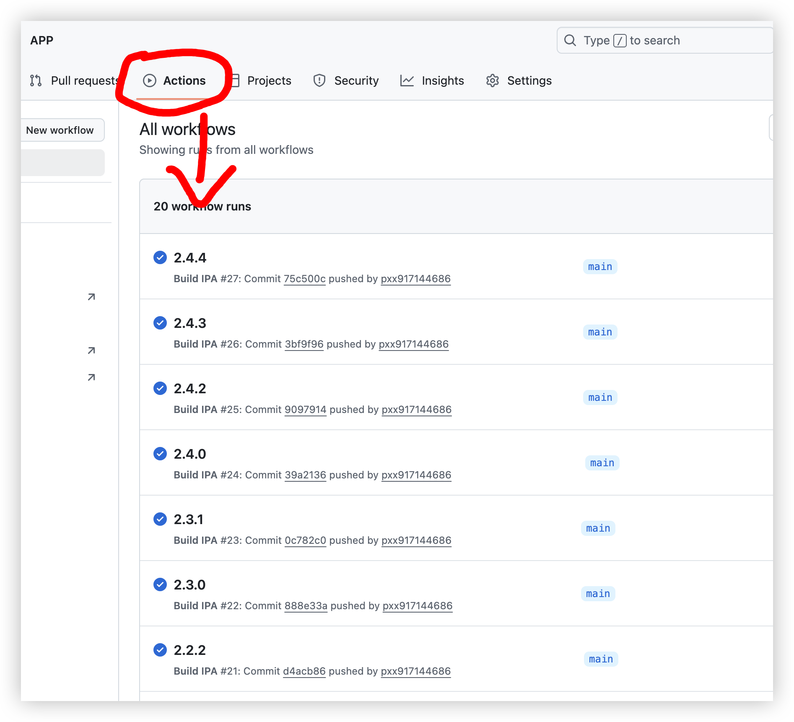
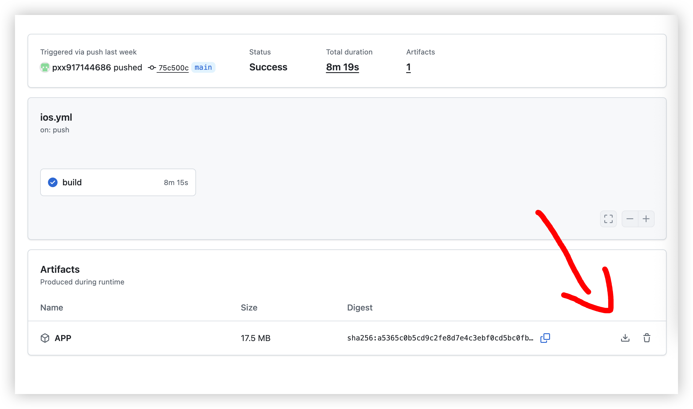

# 工作流
```js

name: Build IPA

on:
  push:
    branches: [ "main" ]
  workflow_dispatch:

jobs:
  build:
    runs-on: macos-15
    steps:
     - uses: actions/checkout@v3
     - name: Compile
       run: make
     
     - name: Upload artifact
       uses: actions/upload-artifact@v4
       with:
        name: APP
        path: APP.ipa
```

# make文件
```js
BASEDIR = $(shell pwd)
BUILD_DIR = $(BASEDIR)/build
INSTALL_DIR = $(BUILD_DIR)/install
PROJECT = $(BASEDIR)/APP.xcodeproj
SCHEME = APP
CONFIGURATION = Release
SDK = iphoneos
DERIVED_DATA_PATH = $(BUILD_DIR)

all: ipa

# 依赖关系
ipa: $(PROJECT)
	mkdir -p ./build
	xcodebuild -jobs 8 -project $(PROJECT) -scheme $(SCHEME) -configuration $(CONFIGURATION) -sdk $(SDK) -derivedDataPath $(DERIVED_DATA_PATH) CODE_SIGN_IDENTITY="" CODE_SIGNING_REQUIRED=NO CODE_SIGNING_ALLOWED=NO ALWAYS_EMBED_SWIFT_STANDARD_LIBRARIES=NO DSTROOT=$(INSTALL_DIR)
	rm -rf ./build/APP.ipa
	rm -rf ./build/Payload
	mkdir -p ./build/Payload
	cp -rv ./build/Build/Products/Release-iphoneos/APP.app ./build/Payload
	cd ./build && zip -r APP.ipa Payload
	mv ./build/APP.ipa ./

# 强制重新构建
force: clean ipa

clean:
	rm -rf ./build
	rm -rf ./APP.ipa

.PHONY: all ipa clean force

```




# 本地编译 APP.ipa 方法
## 终端: cd APP这文件夹
## 终端: make

---

<!-- 左右排列 -->
<div style="display: flex; justify-content: space-evenly; align-items: center; width: 100%; overflow: auto; gap: 40px; padding: 10px 0;">
    
    
    
    
    
    
</div>

<hr style="border: 1px solid #ccc; margin: 20px 0;">

---

<!-- 左右排列 -->
<div style="display: flex; justify-content: space-evenly; align-items: center; width: 100%; overflow: auto; gap: 40px; padding: 10px 0;">
    
    
    
    
    
    
</div>

<hr style="border: 1px solid #ccc; margin: 20px 0;">
